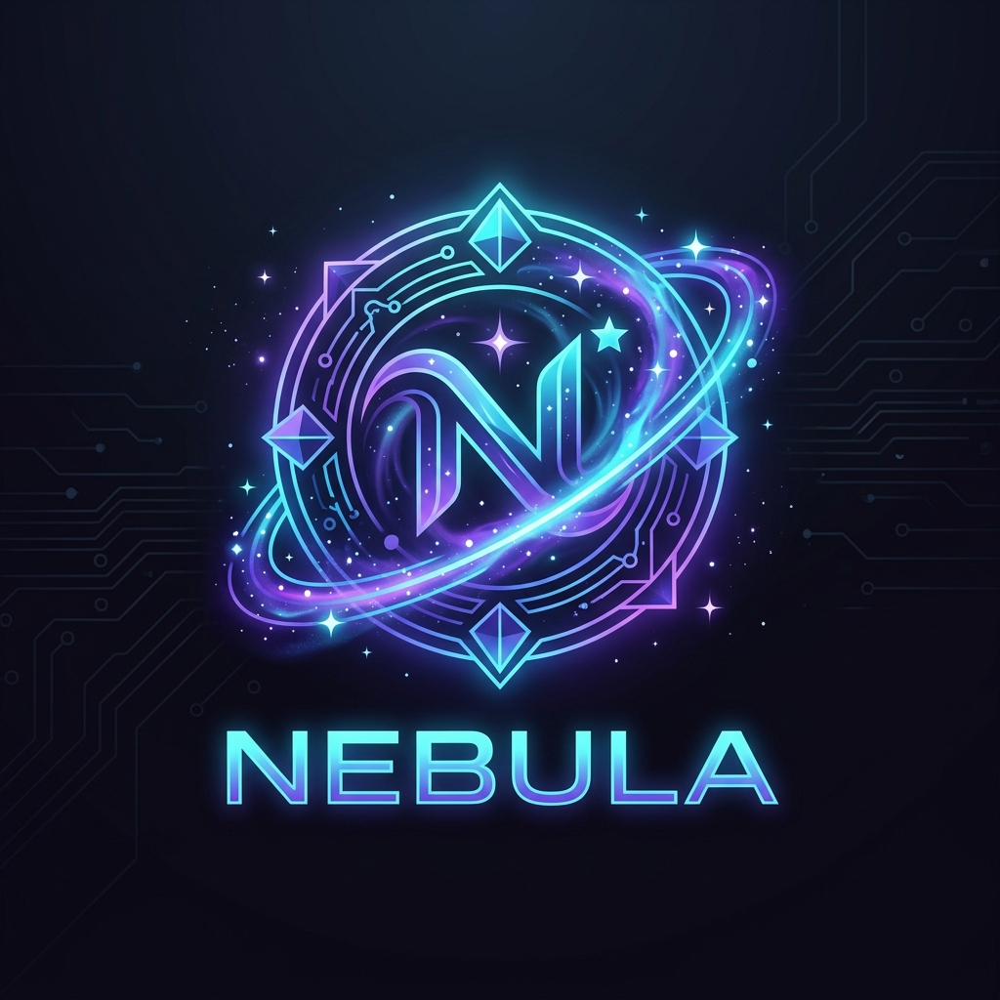

# NEBULA

<p align="center">
  
</p>

<p align="center">
  <strong>Sovereign Autonomous Personal AI Assistant & Speculative Live RAG</strong><br>
  <em>Powered by NVIDIA Nemotron on Nebius Token Factory</em>
</p>

<p align="center">
  
  
  
  
  
</p>

---

## 🌌 Overview

**NEBULA** is a sovereign, always-on personal desktop assistant that pairs complete operating system agency with the power of **NVIDIA Nemotron open-source models hosted on Nebius Token Factory**.

Unlike corporate assistants that harvest user data and suffer from high latency, NEBULA operates with **total data sovereignty** (local ACID SQLite persistence and local vector memory) and provides **sub-second voice & streaming intelligence**.

---

## ⚡ Key Highlights

### 1. Hierarchical Dual-Tier Nemotron Intelligence
- **Tier 1 (Fast Calls & Stream Decider)**: `nvidia/nemotron-3-nano-30b-a3b` running on Nebius Token Factory analyzes partial speech chunks in real-time (<150ms TTFT), predicts intent stability, and decomposes multi-intent queries while stretching API credits.
- **Tier 2 (Deep Reasoning & Tool Calling)**: `nvidia/nemotron-3-super-120b-a12b` / `nemotron-3-ultra` executes complex planning, hardware tool synthesis, and grounded Live RAG answers.

### 2. Complete OS Hardware Control & System Scanner
- **System Scanner (`/scan`)**: Live telemetry of CPU load, RAM usage, display brightness, and all system audio endpoints.
- **Audio Device Switcher**: Hot-switch playback headphones, speakers, and recording microphones directly by voice or command.
- **Display & Audio Agency**: Native controls for brightness, volume, application launcher, and browser takeover across Windows, Linux, and macOS.

### 3. Speculative Live RAG Pipeline
- Ingests streaming speech chunks (`0.0s`, `0.8s`, `1.6s`) and triggers early retrieval *before* the user stops speaking.
- Resolves late-arriving constraints (delta queries) dynamically without restarting turns.
- Strict grounding with exact section citation lineage (`[Doc_XX §YY]`) and zero hallucination.

### 4. Sovereign Personal Persistence
- All chats, multi-turn contexts, user settings, and embeddings are saved locally in `data/nebula.db`.
- Dynamic user profile (`/profile`) and custom response verbosity (`short`, `moderate`, `detailed`).

---

## 🚀 Quickstart Guide

### 1. Clone & Install Dependencies
```bash
git clone https://github.com/abhinav29102005/nebula.git
cd nebula

# Using uv (Recommended)
uv sync

# Or using pip
pip install -e .
```

### 2. Configure Environment
Copy the example environment configuration:
```bash
cp .env.example .env
```

Set your **Nebius Token Factory** API key in `.env`:
```env
LLM_PROVIDER=nebius
NEBIUS_API_KEY=your_token_factory_key_here
NEBIUS_BASE_URL=https://api.tokenfactory.nebius.com/v1
NEBIUS_MODEL=nvidia/nemotron-3-super-120b-a12b
NEBIUS_FAST_MODEL=nvidia/nemotron-3-nano-30b-a3b
```

### 3. Run NEBULA
```bash
# Interactive Cybernetic Terminal
python run.py

# Or on Windows
nebula.bat
```

---

## ⌨️ Cybernetic Slash Commands

| Command | Action |
| :--- | :--- |
| `/model [nebius\|dual\|nvidia\|groq\|qwen]` | Switch active LLM engine dynamically |
| `/scan` | Full hardware scan (CPU, RAM, audio devices, brightness) |
| `/rag <query>` | Query Speculative Live RAG over enterprise policies |
| `/setup`, `/keys` | Interactive API key setup wizard with portal links |
| `/hub` | View cloud provider quotas and portals |
| `/chats`, `/sessions` | List persistent chat sessions with token metrics |
| `/new [title]` | Spawn a new conversation session |
| `/switch <id>` | Switch context window to another session |
| `/profile` | View and update user profile (name, email) |
| `/upgrade [flags]` | Self-upgrade repository, dependencies, and database |
| `/quit`, `/exit` | Safely persist session state and exit |

---

## 🏗️ Technical Architecture

```
User Utterance (Voice / Text)
       │
       ▼
┌───────────────────────────────────────┐
│     NEBULA CYBERNETIC CONTROLLER      │
│  • Timestamped STT Stream Evaluator   │
│  • Semantic Boundary Classifier       │
└──────────────────┬────────────────────┘
                   │
         ┌─────────┴─────────┐
         ▼                   ▼
┌─────────────────┐ ┌───────────────────────────────────┐
│ NEBIUS TIER 1   │ │ LOCAL SOVEREIGN PERSISTENCE       │
│ Nemotron-3-Nano │ │ • SQLite Engine (data/nebula.db)  │
│ <150ms Decider  │ │ • Session & Turn Lineage          │
└────────┬────────┘ └─────────────────┬─────────────────┘
         │                            │
         ▼                            ▼
┌───────────────────────────────────────────────────────┐
│          STREAMING LIVE RAG & HYBRID RETRIEVER        │
│  Dense Vector Search + BM25 Sparse Search + RRF       │
└──────────────────────────┬────────────────────────────┘
                           │
                           ▼
┌───────────────────────────────────────────────────────┐
│                    NEBIUS TIER 2                      │
│  Nemotron-3-Super (120B) / Nemotron-3-Ultra           │
│  Grounded Synthesis with Citations [Doc_XX §YY]       │
└──────────────────────────┬────────────────────────────┘
                           │
         ┌─────────────────┴─────────────────┐
         ▼                                   ▼
┌─────────────────────────────────┐ ┌───────────────────────────────────┐
│ HARDWARE & SYSTEM SKILLS        │ │ AUDIO SYNTHESIS ENGINE            │
│ Sinks, Brightness, Apps, Browser│ │ Piper Neural TTS + Nebula DSP     │
└─────────────────────────────────┘ └───────────────────────────────────┘
```

---

## 📄 License
Open source under the [Apache 2.0 License](LICENSE).
